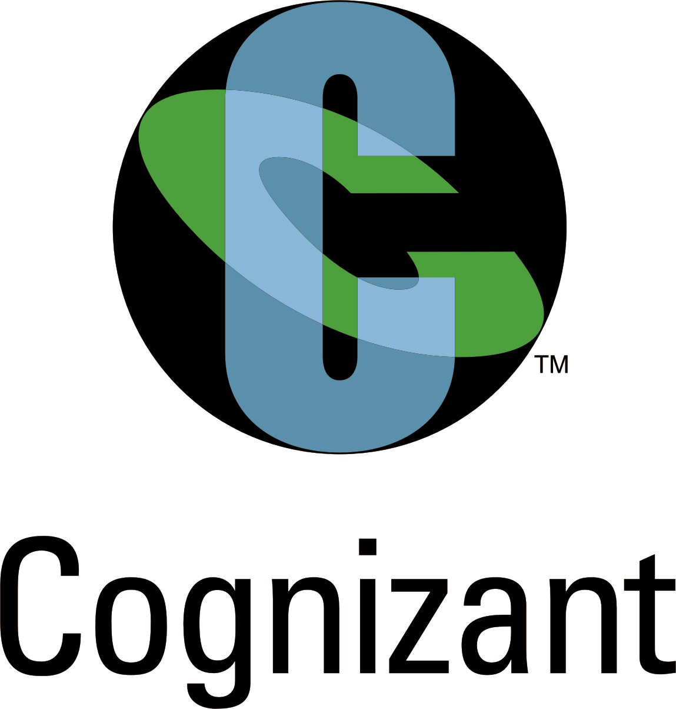

<html>
<head>
<title>Senthil Kumar</title>

</head>
<body>

<h1>SENTHIL KUMAR S</h1>

Intern @ Cognizant 

<h2>ABOUT ME</h2>

I am a self-motivated, reliable, responsible and hard working person. I am enjoy working as a part of a team and I'm adaptable to challenging situations. I am able to work well both in a team environment as well as using my own initiative. I like to seek out learning opportunities and I'm not afraid to fail and struggle as a part of learning.

<h2>EDUCATION QUALIFICATION</h2>

I have completed my secondary school studies in "mani higher secondary school". After that i completed my diploma in the field of "Electrical and electronics engineering" at "Sri ramakrishna polytechnic college". Recently i have completed my bachelor degree in the field of "Electrical and electronics engineering" at "Sri ramakrishna engineering college".
<h2>SOFTWARE SKILLS</h2>

Matlab, java, c, html, Autocad, orcad.

<h2>PROJECTS</h2>
<h3>Automatic hydroponic system</h3>

An advance automation system in the hydroponics plantation for solution maintaining and mixture of the solution ratio control.

<h3>CONTACT</h3>

Feel free to reach me at -

<a href="https://www.gmail.com"style="color:white;">Mail Id:mme1991@gmail.com</a>

 
</body> 
</html>
